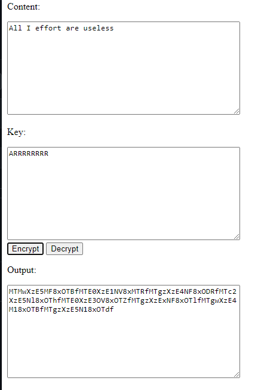
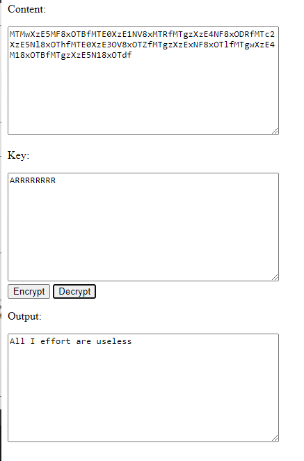
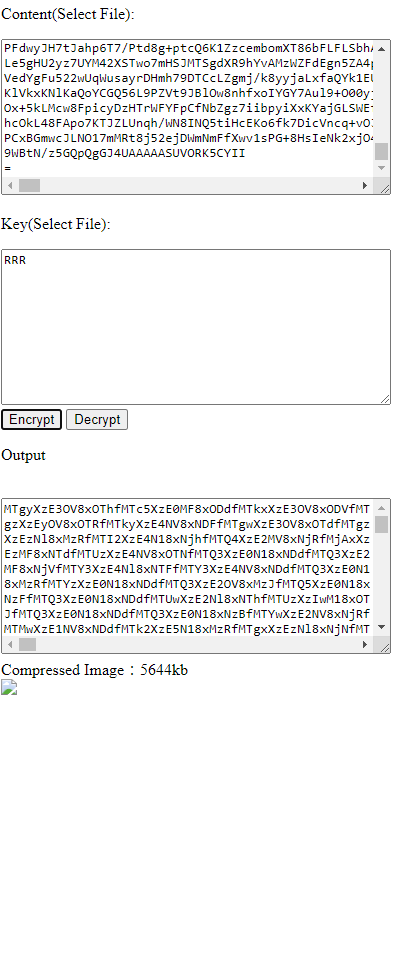

English | [繁體中文](README_TCH.md)

# [Online Tool](https://jingshing.com/encrypt_decrypt/)
You can use this tool on [my website](https://jingshing.com/encrypt_decrypt/).

# Encryptor-Decryptor-JS
Using Javascript and Html to rewrite my old Encryptor-Decryptor.

This is rewrite from my old repo [Encryptor-Decryptor](https://github.com/JingShing/Encryptor-Decryptor).

You can put the content you want to encrypt or decrypt in the content textfield. And put key in key textfield.

Then click button it will encrypt or decrypt for you.

# Example
## Encrypt

## Decrypt

## Encrypt Image

## Decrypt Image

# Log
## Ver0.1
* Feature
  * encrypt from textfield
  * decrypt from textfield
## Ver0.2
* Feature
  * You can now drag your file into the textfield.
  * Now support txt, jpg and png file.
  * It can now encrypt image file.
## Ver0.3
* Feature
  * You can now use [this tool on my website](https://jingshing.com/encrypt_decrypt/).
  * I upgrade my encrypt and decrypt algorithm. To make it lighter and safer.
