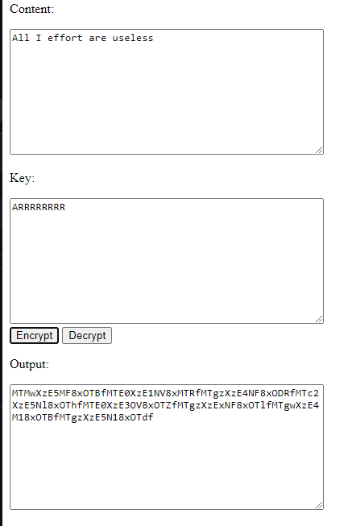

[English](README.md) | 繁體中文

# Encryptor-Decryptor-JS
使用 Javascript 和 Html 重寫我舊的 加解密工具。

這篇 repo 重寫自 [加解密工具](https://github.com/JingShing/Encryptor-Decryptor).

你可以將想要加密或解密的內容放到 content 一欄。將加解密的密鑰放於 key 一欄。

點擊 encrypt 加密；點擊 decrypt 解密。

成果會在 output 中出現。

# Example範例
## Encrypt加密

## Decrypt解密

# Log紀錄
## Ver0.1
* 功能
  * 透過文字框加密
  * 透過文字框解密
