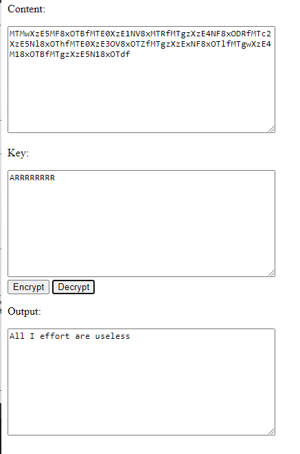
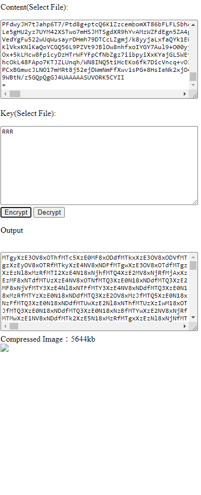
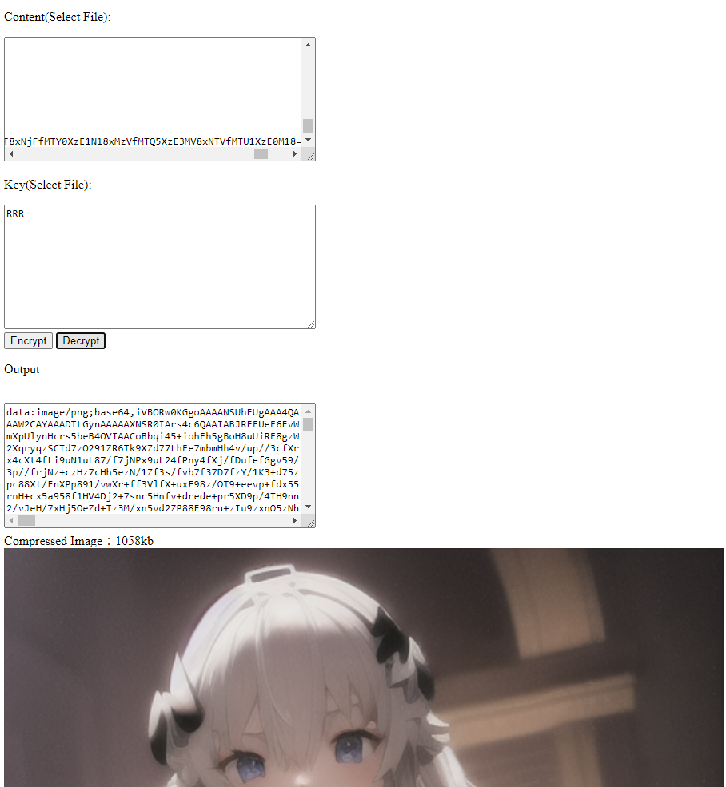

[English](README.md) | 繁體中文
# [線上工具](https://jingshing.com/encrypt_decrypt/)
你可以在 [我的網站](https://jingshing.com/encrypt_decrypt/) 使用這個工具。
# Encryptor-Decryptor-JS
使用 Javascript 和 Html 重寫我舊的 加解密工具。

這篇 repo 重寫自 [加解密工具](https://github.com/JingShing/Encryptor-Decryptor).

你可以將想要加密或解密的內容放到 content 一欄。將加解密的密鑰放於 key 一欄。

點擊 encrypt 加密；點擊 decrypt 解密。

成果會在 output 中出現。

# Example範例
## Encrypt加密

## Decrypt解密

## Encrypt Image加密圖片

## Decrypt Image解密圖片

# Log紀錄
## Ver0.1
* 功能
  * 透過文字框加密
  * 透過文字框解密
## Ver0.2
* 功能
  * 你可以拖拉檔案到文字框讀取檔案內的內容
  * 現已支持 txt, png 和 jpg 檔
  * 現已支持圖片的加密解密
## Ver0.3
* 功能
  * 你現在可以到 [我的網站使用這個工具](https://jingshing.com/encrypt_decrypt/) 了
  * 我優化了下加密和解密的算法，更加的輕盈且安全
